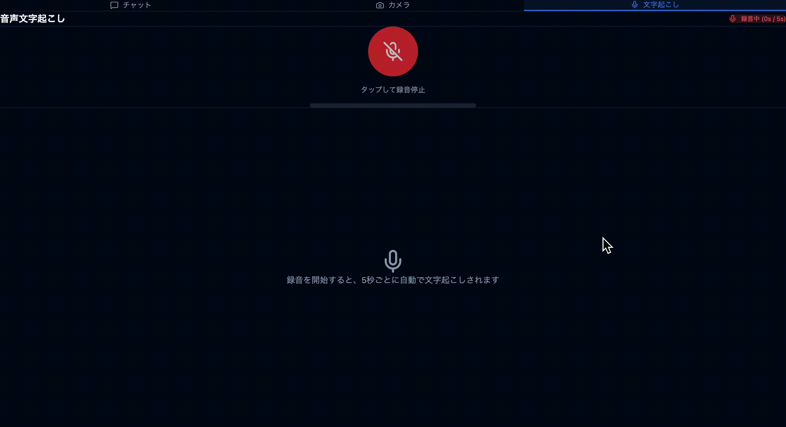

# Chrome Prompt API Demo

A React application demonstrating Chrome's built-in Prompt API with Gemini Nano. Features text chat, real-time camera recognition, audio transcription, and interactive paint recognition modes.

## DEMO

### Describing what appears in the video


### Text Chat 


### Realtime Transcription


### Paint Recognition


## Features

- **Text Chat Mode**: Chat with Gemini Nano using streaming responses
- **Camera Recognition Mode**: Real-time image recognition with auto-capture
- **Audio Transcription Mode**: Real-time speech-to-text transcription
- **Paint Recognition Mode**: Draw on canvas and get AI to recognize your drawings
- **Multimodal Support**: Send images along with text prompts
- **Streaming Responses**: See AI responses as they're generated with auto-scroll

## Prerequisites

### System Requirements

- **OS**: Windows 10/11, macOS 13+ (Ventura), Linux, or ChromeOS (Chromebook Plus)
- **Storage**: At least 22GB free space
- **Memory**: 16GB RAM (for CPU inference) or GPU with 4GB+ VRAM
- **Browser**: Chrome 138 or later

### Chrome Flags Setup

You must enable the following flags in Chrome:

1. Open `chrome://flags` in your browser

2. Enable these flags:

   | Flag | Setting |
   |------|---------|
   | `#optimization-guide-on-device-model` | **Enabled** |
   | `#prompt-api-for-gemini-nano` | **Enabled** or **Enabled multilingual** |
   | `#prompt-api-for-gemini-nano-multimodal-input` | **Enabled** (for camera mode) |

3. Click **Relaunch** to restart Chrome

4. Verify the model status at `chrome://on-device-internals`

## Installation

```bash
npm install
```

## Development

```bash
npm run dev
```

Open http://localhost:5173 in Chrome.

## Build

```bash
npm run build
```

## Usage

### Text Chat Mode

1. Type your message in the text area
2. Press Enter or click the send button
3. Watch the streaming response appear

### Camera Recognition Mode

1. Switch to the "Camera Recognition" tab
2. Click "Start Camera" to enable your webcam
3. Click "Start Auto Recognition" to begin continuous recognition
4. The AI will describe what it sees every 5 seconds
5. Click "Stop Auto Recognition" to pause

### Paint Recognition Mode

1. Switch to the "Paint" tab
2. Select a tool from the toolbar:
   - **Pen**: Draw with the selected color and line width
   - **Eraser**: Remove parts of your drawing
   - **Fill**: Fill enclosed areas with the selected color
3. Choose a color using the color picker
4. Adjust the line width using the slider (1-50px)
5. Draw on the canvas with your mouse or touch device
6. After each stroke (mouse up/touch end), the AI automatically recognizes your drawing
7. View AI responses in the right panel with Markdown formatting
8. Use the "Clear" button to start over

## Tech Stack

- React 19
- TypeScript
- Vite
- Tailwind CSS v4
- Lucide React (icons)
- React Markdown (for AI response rendering)

## Project Structure

```
src/
├── components/
│   ├── Chat.tsx                # Main chat component
│   ├── ChatMessage.tsx         # Message display with Markdown rendering
│   ├── ChatInput.tsx           # Input form with camera capture
│   ├── CameraView.tsx          # Camera preview component
│   ├── AudioTranscription.tsx  # Audio transcription component
│   └── PaintCanvas.tsx         # Interactive paint tool with AI recognition
├── hooks/
│   └── usePromptAPI.ts         # Chrome Prompt API integration
├── types/
│   └── prompt-api.d.ts         # TypeScript definitions
├── App.tsx                     # Tab switching (Text, Camera, Audio, Paint)
├── main.tsx
└── index.css                   # Tailwind CSS
```

## API Reference

### Check Availability

```typescript
const availability = await LanguageModel.availability();
// Returns: 'available' | 'downloadable' | 'no'
```

### Create Session

```typescript
const session = await LanguageModel.create({
  systemPrompt: 'You are a helpful assistant.',
  expectedInputLanguages: ['en', 'ja'],
  expectedOutputLanguages: ['en'],
  temperature: 0.7,
  topK: 3,
});
```

### Send Prompt (Streaming)

```typescript
const stream = session.promptStreaming('Hello!');
for await (const chunk of stream) {
  console.log(chunk);
}
```

### Multimodal Input

```typescript
const session = await LanguageModel.create({
  expectedInputs: [{ type: 'image' }],
  expectedOutputLanguages: ['en'],
});

const response = await session.prompt([
  {
    role: 'user',
    content: [
      { type: 'text', value: 'What is in this image?' },
      { type: 'image', value: canvasElement },
    ],
  },
]);
```

## Troubleshooting

### "LanguageModel API not found"

- Ensure you're using Chrome 138+
- Check that the required flags are enabled
- Restart Chrome after enabling flags

### Model not downloading

- Verify you have 22GB+ free storage
- Check `chrome://on-device-internals` for errors
- Ensure you have an unmetered network connection

### Camera not working

- Allow camera permissions when prompted
- Enable `#prompt-api-for-gemini-nano-multimodal-input` flag

## Resources

- [Chrome Prompt API Documentation](https://developer.chrome.com/docs/ai/prompt-api)
- [Chrome Built-in AI Overview](https://developer.chrome.com/docs/ai)
- [Debug Gemini Nano](https://developer.chrome.com/docs/ai/debug-gemini-nano)

## License

MIT
